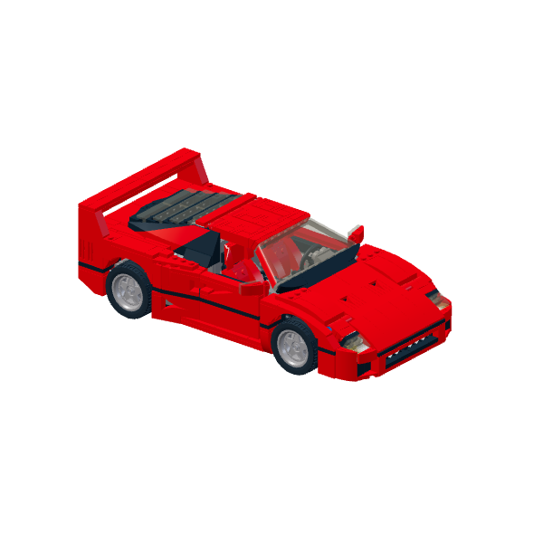
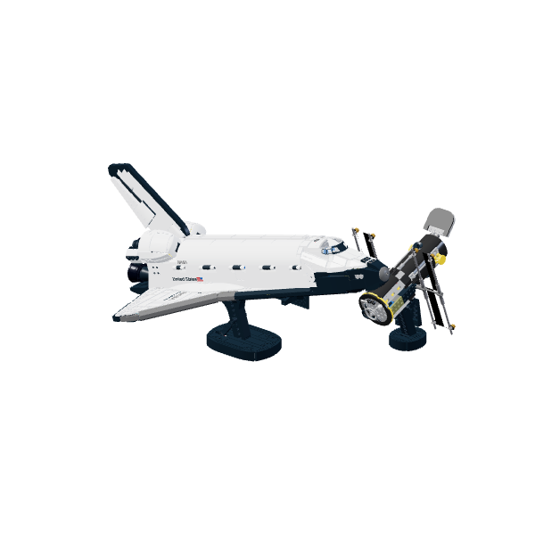

# BrickCraft Studio

[](https://github.com/Atakan-Emre/BrickCraft-Studio/actions/workflows/deploy-pages.yml)
[](https://github.com/Atakan-Emre/BrickCraft-Studio/actions/workflows/ci.yml)

**[Open the live studio](https://atakan-emre.github.io/BrickCraft-Studio/)** · [Türkçe](#türkçe) · [Contributing](CONTRIBUTING.md) · [Model attribution](SOURCES.md)

An interactive, browser-based 3D construction studio built with React, Three.js, and LDraw geometry. Select a detailed model, pick up individual bricks, rotate them on every axis, and assemble the build at your own pace.

BrickCraft Studio is available in English and Turkish, works entirely in the browser, and keeps each model workspace on the device that created it.

## Model gallery

| Ferrari F40 | Sakura Bonsai | NASA Discovery |
| --- | --- | --- |
|  |  |  |

Rendered from the attributed LDraw models; see [sources and licenses](SOURCES.md).

## Highlights

- Build manually with real LDraw part geometry instead of a step-by-step viewer.
- Drag, rotate, position, duplicate, and remove individual pieces in a 3D workspace.
- Switch between free-build and guided-build modes; optional hints never place pieces automatically.
- Explore six detailed models, including the Ferrari F40, Eiffel Tower, Carriage House, Sakura Bonsai, NASA Discovery, and Flower Bouquet.
- Restore the last workspace, selected model, language, theme, preferences, and favourites with `localStorage`.
- Use Turkish or English and choose a light or dark interface.
- Export a build as JSON and download a bill of materials as CSV.

## Quick start

**Requirements:** Node.js 22.12+ and npm; a browser with WebGL support.

```sh
git clone https://github.com/Atakan-Emre/BrickCraft-Studio.git
cd BrickCraft-Studio
npm ci
npm run dev
```

Open the local address printed by Vite. For a production build:

```sh
npm run build
npm run preview
```

## Commands

| Command | Purpose |
| --- | --- |
| `npm run dev` | Start the local development server. |
| `npm run build` | Produce the deployable build in `dist/client`. |
| `npm test` | Run the application test suite after building. |
| `npm run test:deployment` | Check built entry points, model files, geometry packages, previews, and licenses. |
| `npm run test:sites` | Verify the generated worker hand-off files. |
| `npm run validate:models` | Validate LDraw geometry while the local server is running. |

## GitHub Pages

The live app is published at **https://atakan-emre.github.io/BrickCraft-Studio/**. The repository path is case-sensitive.

In **Settings → Pages**, choose **GitHub Actions** as the source. The deployment workflow reads the base path from GitHub Pages before building, runs the tests, validates the output, and publishes only `dist/client`. It supports renamed repositories and custom domains without a hard-coded repository name.

To reproduce the project-path build locally:

```sh
VITE_BASE_PATH=/BrickCraft-Studio/ npm run build
npm test
VITE_BASE_PATH=/BrickCraft-Studio/ npm run test:deployment
VITE_BASE_PATH=/BrickCraft-Studio/ npm run preview
```

Open `http://localhost:4173/BrickCraft-Studio/`. Model JSON, part geometry, previews, and source downloads all use the same deployment prefix. The CI workflow checks both `/` and `/BrickCraft-Studio/` before a pull request is merged.

If a deployment shows a blank page, check the latest Actions run and the browser console for missing JavaScript or stylesheet files. Do not clear browser storage as a troubleshooting step; export your build before removing any site data. See the [Vite GitHub Pages guide](https://vite.dev/guide/static-deploy.html#github-pages).

## Project structure

```text
src/                 React UI, Three.js editor, placement rules, persistence
public/models/       Model manifests, previews, and original MPD sources
public/ldraw/        Bundled part geometry and LDraw license notices
scripts/             Model preparation, geometry and deployment validation
tests/               Editor, placement, storage, translation, and worker tests
.github/workflows/   CI checks and GitHub Pages deployment
worker/              Optional Sites worker, not used by GitHub Pages
```

## How to use the editor

- Drag a part from the inventory to the workbench, then pick it up again to reposition it.
- Use the rotate tool's 3D rings or the X, Y, and Z controls. `R` rotates around Y; `Shift + R` rotates around X.
- Move a selected part up or down one plate at a time, or enter an exact position in the inspector.
- Press `F` to focus the camera, `D` to pick up another copy, `Delete` to remove a selected part, and `Esc` to cancel the active piece.
- Drag empty space to orbit the camera; right-drag to pan; scroll or pinch to zoom.
- Press `H` only when you want a placement hint. Hints identify a target part and location, but you always perform the placement.

## Model sources and attribution

| Model | Physical elements in source | Designer | License |
| --- | ---: | --- | --- |
| Ferrari F40 10248 | 1,157 | Magnus Forsberg | CC BY 2.0 |
| Eiffel Tower 21019 | 320 | Damien Roux; flexible axle by Orion Pobursky | CC BY 2.0 |
| Carriage House | 1,698 | Michael Horvath | CC BY-SA 4.0 |
| Sakura Bonsai 10281 / Cherry Blossoms | 751 | Orion Pobursky | CC BY 2.0 |
| NASA Discovery 10283 | 2,318 | Orion Pobursky | CC BY 2.0 |
| Flower Bouquet 10280 | 750 | Orion Pobursky | CC BY 2.0 |

See [SOURCES.md](SOURCES.md) for source links, provenance, and full attribution. The model counts are source-file physical elements, not official retail inventory counts. Original MPD source files are preserved without modification.

## Scope and limitations

Standard rectangular bricks and plates align to real stud spacing in horizontal and 90-degree orientations, and body collisions are prevented. Specialized parts use grid and surface alignment; a universal connection or collision simulation for pins, clips, hinges, and flexible elements is not included. A freely positioned specialized part can therefore intersect or float.

The app has no cloud account or server-side storage. Browser data is saved locally; clearing site data removes local workspaces. JSON export provides a portable backup.

BrickCraft Studio is an independent community prototype and is not affiliated with, endorsed by, or sponsored by the LEGO Group.

## License

The included third-party model sources retain their respective licenses listed above and in [SOURCES.md](SOURCES.md). No separate license has been granted for the application source code yet.

## Türkçe

BrickCraft Studio, gerçek LDraw parça geometrileriyle tarayıcıda çalışan bir 3B yapım atölyesidir. **[Canlı uygulamayı aç](https://atakan-emre.github.io/BrickCraft-Studio/)** ve üst çubuktan **TR** dilini seç.

- Altı detaylı modelden birini seç; parçaları sürükle, döndür ve yerleştir.
- Model envanteriyle veya serbest modda çalış; gerektiğinde ipucu iste.
- Her modelin çalışma alanı, dil, tema ve favoriler aynı tarayıcıda otomatik saklanır.
- Yapımını JSON olarak yedekle ve tekrar aç; malzeme listesini CSV olarak indir.
- Kurulum: Node.js 22.12+ ile `npm ci`, ardından `npm run dev`.
- Kontrol: `npm run build`, `npm test` ve `npm run test:deployment`.

Kayıtlar cihazlar arasında eşitlenmez. Pin, klips, menteşe ve esnek parçalarda evrensel bağlantı/çarpışma simülasyonu bulunmaz. Kaynak yazarları ve lisanslar [SOURCES.md](SOURCES.md) dosyasındadır.
